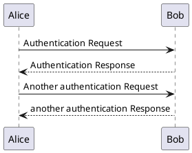

# MkDocs

## PlantUMLを使う

- [PlantUML](https://plantuml.com/ja/)

インストールする。

```
pip install plantuml-markdown
```

`mkdocs.yml`へ追記する。

```
markdown_extensions:
  - plantuml_markdown:
      server: http://www.plantuml.com/plantuml
```

`server`にあるのはPlantUMLのサーバーのURL。

自前でサーバーを立てることも可能。
Dockerを使うと楽そう。

- https://hub.docker.com/r/plantuml/plantuml-server/

Docker Composeを使ってサーバーを立ててMkDocsから参照しようとしたけどエラーになる。
理由はわからない。

仕方がないのでPlantUMLをインストールして実行するようにした。
その場合はサーバーの指定は要らない。
詳しくはこのノートのリポジトリにある`docker/Dockerfile`と`mkdocs.yml`を参照のこと。

PlantUMLの準備ができたら、あとはドキュメント内に\`\`\`で囲ってPlantUMLの記法で書くだけ。

~~~
```
@startuml
Alice -> Bob: Authentication Request
Bob --> Alice: Authentication Response

Alice -> Bob: Another authentication Request
Alice <-- Bob: another authentication Response
@enduml
```
~~~

実行例は次の通り。


